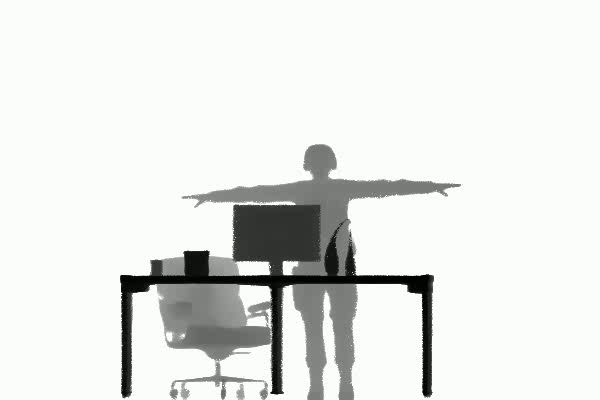

# Data

Due to the upload restrictions of GitHub, we uploaded the complete data to Baidu online disk:
URL: https://pan.baidu.com/s/1psyJFYBkB21WjiB5zdmzAA 
Code: bud8

# dynamically displayed 360° results and GT

| Result 1 | GT 1 |  |
|-------|-------|-----|
|  |  |  |

|  |  |  |

| Result 2 | GT2 |  |
|-----|-----|-----|
|  |  |  |

|  |  |  |
